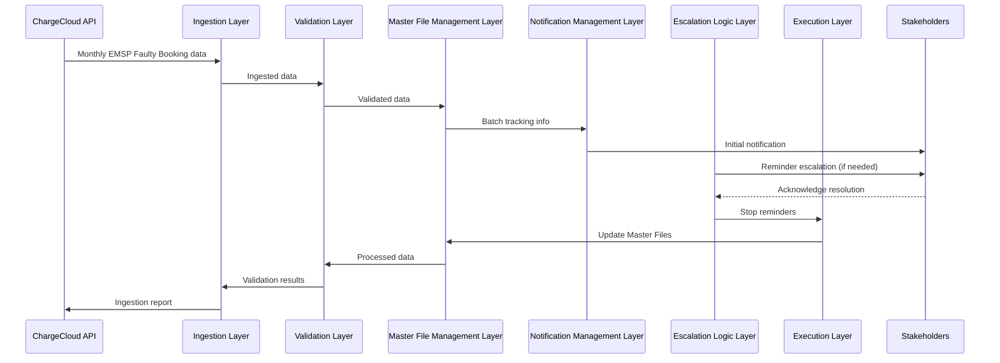

# 🔋 EMSP Faulty Booking Automation System

## **Enterprise Technical Documentation — Architecture, Workflow, Sequence & Timeline Specification**

**Version:** Production Architecture  
**Audience:** Backend Engineers, Solution Architects, DevOps, Technical Leads  

---

## **1️⃣ Executive Overview**

The EMSP Faulty Booking Automation System is an event-driven backend monitoring solution engineered to automate detection, validation, and escalation of faulty EV charging sessions within an OCPI-integrated EMSP environment.

In high-volume EV ecosystems, faulty sessions can propagate downstream failures such as:

- Settlement mismatches
- Invoice delays
- Partner reconciliation conflicts
- Revenue leakage

This automation introduces a **state-aware, timeline-driven communication engine** that continuously monitors faulty sessions and orchestrates structured email-based escalation while maintaining strict thread continuity.

Unlike stateless scripts, this system maintains **historical state tracking**, ensuring deterministic behavior across repeated executions.

---

## **2️⃣ System Scope & Responsibilities**

### **Core Responsibilities**

- Monthly EMSP Faulty Booking ingestion via ChargeCloud API
- MongoDB-based authoritative validation
- Persistent batch tracking via Master Files
- Automated notification lifecycle management
- Reminder escalation logic based on temporal thresholds
- Thread-safe execution under distributed scheduling

### **Non-Functional Goals**

- Idempotent execution
- High observability through structured logging
- Deterministic escalation timelines
- Data minimization and privacy enforcement
- Operational resiliency through retry & lock mechanisms

---

## **3️⃣ Enterprise System Architecture**

The automation follows a layered modular architecture designed for extensibility.

### **3.1 Logical Architecture Layers**

- **Ingestion Layer**: Responsible for monthly ingestion of EMSP Faulty Bookings via the ChargeCloud API. This layer ensures that all relevant data regarding EV charging sessions is collected in a timely and efficient manner.

- **Validation Layer**: Utilizes MongoDB for authoritative validation of the ingested data. This step is crucial to ensure the integrity and accuracy of the information before it is processed further.

- **Master File Management Layer**: Handles the creation and maintenance of Master Files which serve as persistent batch trackers. These files are essential for keeping a reliable record of all processing activities and their outcomes.

- **Notification Management Layer**: Automates the lifecycle management of notifications related to faulty bookings. This includes the initial alerting of relevant stakeholders and the escalation of issues that are not resolved within predefined timeframes.

- **Escalation Logic Layer**: Implements reminder escalation logic based on temporal thresholds. If an issue is not addressed in a timely manner, this layer ensures that reminders are sent out to prompt action.

- **Execution Layer**: Guarantees thread-safe execution of the entire process under distributed scheduling. This is vital for maintaining the system's performance and reliability, especially in a high-volume environment.

---

## **4️⃣ Workflow Specification**

The workflow of the EMSP Faulty Booking Automation System is triggered monthly and follows these steps:

1. **Data Ingestion**: The system ingests EMSP Faulty Booking data from the ChargeCloud API.
2. **Data Validation**: Ingested data is validated using MongoDB to ensure accuracy and integrity.
3. **Batch Tracking**: Creation and updating of Master Files to track processing batches.
4. **Notification Dispatch**: Automated notifications are sent to relevant stakeholders regarding faulty bookings.
5. **Escalation Handling**: If issues are not resolved, the system escalates the matter according to the predefined reminder logic.
6. **Logging and Monitoring**: Throughout the process, the system maintains high observability with structured logging for all actions and decisions taken.

---

## **5️⃣ Sequence Diagram**

---

## **6️⃣ Timeline Specification**

The following timeline specifies the expected duration for each phase of the EMSP Faulty Booking Automation process:

| Phase                     | Duration         |
|---------------------------|------------------|
| Data Ingestion            | 1st - 5th of month |
| Data Validation           | 6th - 10th of month |
| Batch Tracking            | 11th - 15th of month |
| Notification Dispatch     | 16th - 20th of month |
| Escalation Handling       | 21st - 25th of month |
| Logging and Monitoring    | Ongoing          |

---

## **7️⃣ Operational Considerations**

- The system is designed for idempotent execution, ensuring that reprocessing of data does not lead to duplicate notifications or erroneous escalations.
- High observability is achieved through structured logging, allowing for easy tracking of the system's actions and quick identification of any issues that may arise.
- Deterministic escalation timelines are enforced, guaranteeing that all stakeholders are reminded and escalated in a timely manner if issues are not resolved.
- Data minimization and privacy enforcement are prioritized, with the system only processing and retaining data that is necessary for the automation of faulty booking detection and resolution.
- Operational resiliency is built-in, with retry and lock mechanisms in place to handle any transient failures that may occur during the execution of the automation process.

---

## **8️⃣ Conclusion**

The EMSP Faulty Booking Automation System represents a significant advancement in the automated management of EV charging session faults. With its robust architecture, well-defined workflow, and comprehensive operational considerations, the system is poised to greatly enhance the reliability and efficiency of EMSP operations in the face of faulty booking challenges.
